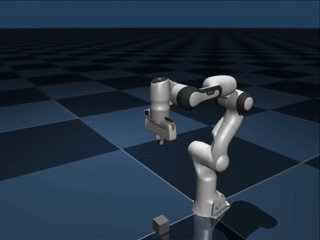

# Panda MuJoCo
Model of the Franka Emika Robot System (formerly known as Panda) for the MuJoCo physics engine. The model uses torque-based actuation for the links and servos for the grippers. Currently the dynamic parameters are derived from:
```
@article{gaz2019dynamic,
  title={Dynamic identification of the franka emika panda robot with retrieval of feasible parameters using penalty-based optimization},
  author={Gaz, Claudio and Cognetti, Marco and Oliva, Alexander and Giordano, Paolo Robuffo and De Luca, Alessandro},
  journal={IEEE Robotics and Automation Letters},
  volume={4},
  number={4},
  pages={4147--4154},
  year={2019},
  publisher={IEEE}
}
```
